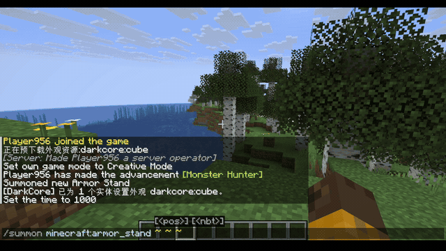

# EntityReskin

> A distributed, signed content-delivery and runtime-rendering system that re-skins
> Minecraft: Java Edition entities with Bedrock-format assets — across a custom binary
> protocol, a Spring Boot asset backend, and a Fabric client rendering engine.

[](https://github.com/zzz1999/EntityReskin/actions/workflows/ci.yml)
[](LICENSE)


## Demo

<p align="center">
  
</p>

<p align="center"><em>A vanilla entity re-skinned at runtime — Bedrock-format geometry, texture, and
animation, streamed from the backend and baked in memory; assets are wiped on disconnect.</em></p>

## Overview

A Minecraft server assigns a visual `identifier` to any entity; players running the
client mod then see that entity rendered from Bedrock-format assets (geometry, textures,
animations), while unmodded players are unaffected and keep playing normally.

It began as an experiment with one question: can a Java Edition client fetch a model from a
backend at runtime and use it to change how a live entity is rendered? That experiment grew
into the end-to-end system described below.

The interesting engineering is not the re-skin itself — it is the **delivery**. Assets
never ship inside the mod and never touch the player's disk. They are streamed on demand
from the backend over a signed, integrity-checked, rate-metered channel, baked entirely
in memory, and discarded the moment the player disconnects.

## How it works

| Module   | Role | Status |
|----------|------|--------|
| `shared` | Version-independent wire protocol & manifest format (plain Java, Java 8 bytecode; the single source of truth shared by backend, server, and client). | Stable |
| `web`    | Asset backend (Spring Boot 4 / Java 21): accounts, asset upload, per-server signed manifests, rate-limited signed downloads, per-account usage accounting. | Working |
| `server` | Bukkit/Paper plugin (zero-NMS, one jar for 1.13 → latest): assigns identifiers and relays them over the control channel. | Working |
| `client` | Fabric client mod (MC 1.21.x): handshake, on-demand download, in-memory GeckoLib bake, selective renderer replacement. | Working (core pipeline) |

```
  Server owner          Minecraft server                  Player — modded client
       │              (Bukkit / Paper plugin)                  (Fabric mod)
       │ upload assets        │                                     │
       │ define appearance    │   set identifier (command / API)    │  handshake
       ▼                      │ ── control channel (plugin msg) ──▶ │
 ┌──────────────┐             │     custom binary protocol          │  fetch signed manifest,
 │  Web backend │             │     (metadata only)                 │  then download assets
 │ Spring Boot  │ ◀───────────┴─────────────────────────────────────┤  over HTTPS
 │ auth·billing │   signed manifest  +  rate-limited,                │  (SHA-256 verified)
 │ signed URLs  │   SHA-256-verified asset downloads                 ▼
 └──────────────┘                                        in-memory GeckoLib bake
                                                          → mixin renderer swap
                                                          → render with animation
                                                          (assets wiped on disconnect)
```

The **control plane** (plugin-messaging channel) carries only small metadata; the **data
plane** (bulk assets) is a separate HTTPS path from the backend. They are fully decoupled.

## Engineering highlights

**Distributed system & protocol**
- Custom binary wire protocol with a shared codec (Java 8 bytecode) reused *verbatim* by
  backend, server plugin, and client — one source of truth for framing, with strict
  per-direction size bounds (1 MiB S2C / 32 KiB C2S).
- Control plane (metadata over the plugin-messaging channel) cleanly separated from the
  data plane (bulk assets over HTTPS).
- Deterministic, content-addressed manifest with SHA-256 integrity checks and byte-for-byte
  reproducible serialization — so a fixed manifest hash can pin content while signed asset
  URLs still rotate underneath it.

**Backend — Spring Boot 4 / Java 21**
- Stateless JWT auth with email verification, anti-enumeration responses, and per-email/IP
  rate limiting on the auth endpoints.
- HMAC-SHA256 signed download URLs on a **deterministic rolling-window** scheme (stable 12h
  half-windows): URLs expire, yet the manifest bytes stay constant within a window.
- Per-server **token-bucket byte-rate limiting** and atomic, per-account byte accounting.
- Content-addressed (SHA-256) **opaque-byte** blob storage — uploads are never parsed,
  removing a whole class of injection surface. H2 (dev) / MySQL (prod) profiles.

**Client engine — Fabric / MC 1.21.x**
- Mixin into the entity render dispatcher for **selective, per-entity** renderer
  replacement — vanilla entities are left untouched.
- Runtime, **in-memory** baking of Bedrock-format geometry, textures, and animations via
  GeckoLib (bundled jar-in-jar) — assets live only in memory and are wiped on disconnect.
- Defensive asset gateway: decompression-bomb guards, geometry/size ceilings, async
  timeouts, and graceful fallback to the vanilla model on any failure.

**Engineering practice**
- Security hardening driven by a 20-finding adversarial review.
- Multi-module Gradle across three toolchains (Java 8 `shared` / Java 21 backend / JDK 21
  Fabric mod); CI on every push; dedicated protocol & manifest design docs.
- Verified **end-to-end on real hardware**: server → backend → modded client → an animated,
  re-skinned entity.

## Tech stack

Java 8 & 21 · Spring Boot 4 (Security, Data JPA) · H2 / MySQL · Bukkit/Paper API ·
Fabric Loader & API · Fabric Loom · Mixin · GeckoLib · Gradle (Kotlin DSL) · GitHub Actions.

## Build & run

Requires **JDK 21**.

```bash
# shared protocol, web backend, server plugin (root build)
./gradlew build                        # compile everything + run tests
./gradlew :shared:publishToMavenLocal  # publish the shared protocol for the client build
./gradlew :web:bootRun                 # run the asset backend (http://localhost:8080, H2 file DB)
./gradlew :server:jar                  # build the Bukkit plugin → server/build/libs

# client mod (separate Gradle build)
cd client && ./gradlew build           # build the Fabric mod → client/build/libs
```

## Documentation

- [docs/PROTOCOL.md](docs/PROTOCOL.md) — wire protocol and the plugin ↔ backend contract.
- [docs/MANIFEST.md](docs/MANIFEST.md) — manifest format, signing, and caching semantics.
- [docs/E2E-TESTING.md](docs/E2E-TESTING.md) — end-to-end test runbook.

*(Design docs are currently written in Chinese.)*

## Status & roadmap

Early-stage: the core pipeline is functional, but this is not yet a packaged release.

- **Done** — shared protocol; backend auth, upload, signed manifests, rate-limited signed
  downloads, billing; server plugin; client handshake, download, in-memory bake, selective
  render replacement, and animation playback (verified end-to-end).
- **In progress** — web management dashboard UI.
- **Planned** — Bedrock animation controllers and render controllers (full MoLang); more
  Minecraft versions (1.20.1 / 1.16.5) via Stonecutter; object-storage / CDN migration.

## License

[MIT](LICENSE). Bundles GeckoLib, which is also MIT-licensed.
